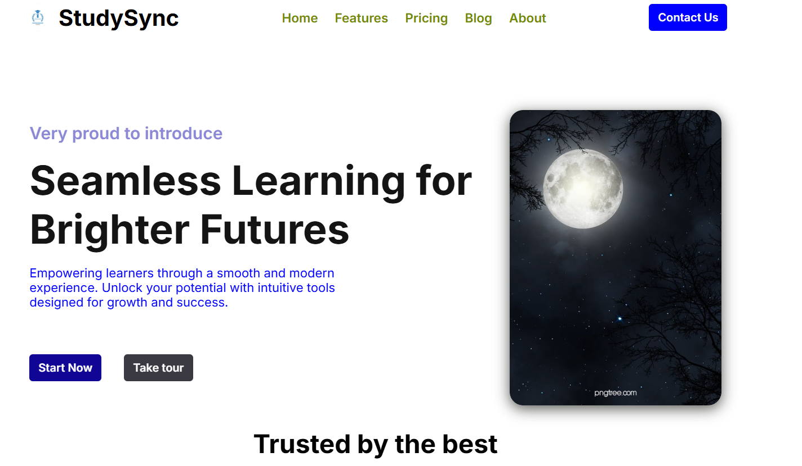

# 🧪 Study Sync (Practice Project)

This is a responsive landing page created as a practice project using **HTML** and **CSS**. It was built to improve my front-end skills and experiment with layout, responsiveness, and basic UI styling.

---

## 🧰 Tech Stack

- HTML
- CSS

---

## 🎯 Purpose

- Practicing semantic HTML structure
- Working with responsive design using media queries
- Improving CSS layout techniques (Flexbox, Grid)

---

## 📷 Screenshot

---

## 🚀 Live Demo

🔗 [View Project](https://abishek2002tk.github.io/Study-Sync-project)

---

## 📁 Folder Structure

